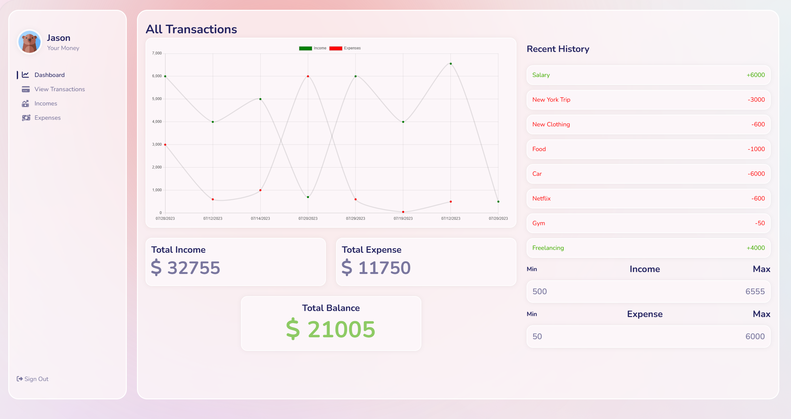
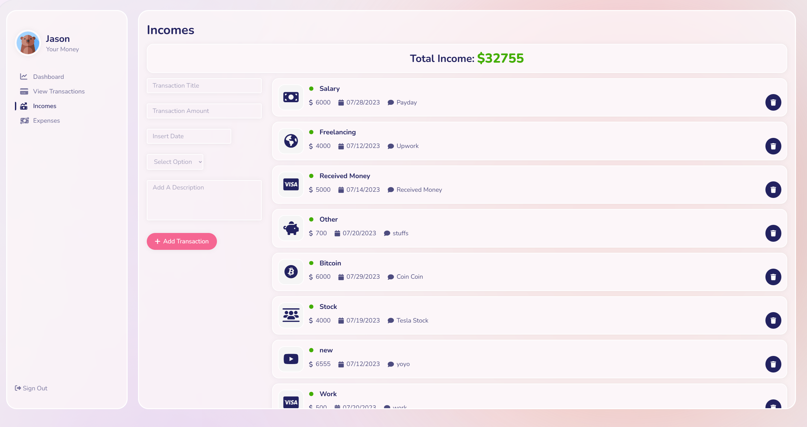
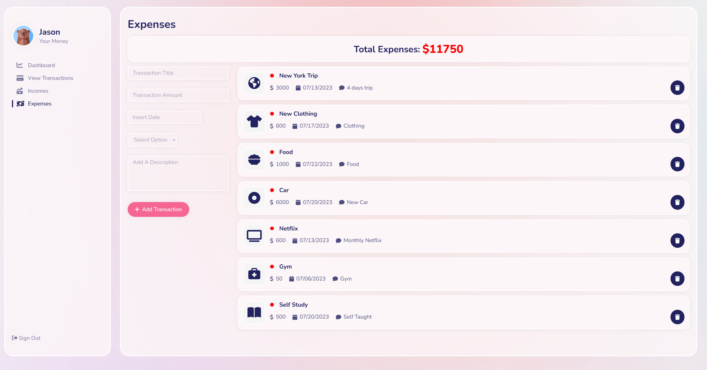

# expenses-tracker
Welcome to the Expense Tracker project! This web application is designed to help you manage your personal finances by tracking your expenses and income transactions. It provides a user-friendly interface that allows you to easily insert new transactions, view your transaction history, and analyze your financial data.

## Features

**Transaction Management**: Add new expenses and income transactions, categorize them, and keep a record of all your financial activities.

**Transaction History**: View a comprehensive list of all your transactions, including details such as the date, amount, and category.

**Categorization**: Organize your transactions into categories to gain insights into your spending habits and income sources.

**Balance Calculation**: Automatically calculates and displays your account balance based on your transactions.

**Charts and Graphs**: Visualize your financial data using charts and graphs to gain a better understanding of your spending patterns.

**Responsive Design**: Enjoy a seamless experience across different devices, thanks to the responsive design that adapts to different screen sizes.

## Technologies Used
Node.js, React, MongoDB, Chart.js

## Getting Started

To get started with the Expense Tracker project using Vite, follow these steps:

1. Clone the repository: `git clone https://github.com/jasonsonthanhngo/expense-tracker.git`
2. Navigate to the project directory: `cd expense-tracker`
3. Install the dependencies: `npm install`
4. Start the development server: `npm run dev`
5. In your terminal, you will see a message like `Server running at:`
   - Ctrl+click on the **localhost:5137** link to open the application in your browser.

Please ensure that you have Node.js installed on your machine before running the application. Additionally, make sure you have Vite installed globally by running `npm install -g create-vite` if you haven't done so already.

Remember to adjust the repository URL, directory name, and port number to match your specific setup.

## Preview

Dashboard view presenting a visual chart illustrating income and expenses, accompanied by a balance summary for an at-a-glance understanding of financial standing.

Income page displaying a form to add new income transactions and a list of previous income transactions, empowering users to track and categorize various sources of income.

Expense page featuring a form to add new expense transactions and a list of previous expense transactions, facilitating effective tracking and management of spending habits.

**Credits**

I would like to thank [The Code Dealer](https://www.youtube.com/@TheCodeDealer) for their tutorial on building an expense tracker. Their video [Full Stack Development with React and Node js - Expense Tracker Application.](https://www.youtube.com/watch?v=i0JesTevAcA&ab_channel=TheCodeDealer) provided valuable guidance and inspiration for this project.

